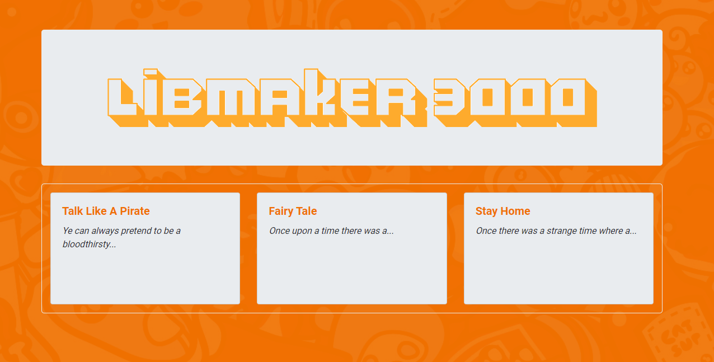

# LibMaker 3000  

MIT
Copyright (c) [2021] [Kelli King, Austyn Whaley, Mengmei Tu, Evan Robinson, Juan Munoz]

---

### Table of Contents

- [Link to Application](https://github.com/thorgriffs/make-your-madlibs)
- [Description](#description)
- [Technologies](#technologies)
- [Installation](#installation)
- [Usage](#usage)
- [Testing](#Testing)
- [Contribution](#Contribution)
- [Questions](#Questions)

---

## Description

The LibMaker 3000 is a Mad Lib generator that takes user input and plugs it into a pre-defined story template.  The completed Mad Lib story is displayed and saved to the database to be later viewed in the Archives.
---

## Technologies

This application utilizes the following dependencies:

    express
    express-handlebars
    madlibs-template-parser
    mysql
    mysql2
    sequelize

---

## Installation

#### To install this program you will need to run

#### `npm install`

---

## Usage

#### Usage for this application:

Creating and posting madlibs to share with friends!
[Libmaker 3000](https://makeyourmadlib.herokuapp.com/)

---

## Testing

#### How to test application:

#### run `npm test`

---

## Contribution

#### The guidelines for contributon to this application are as follows:

Fork the repo and submit a pull request.

---

## Questions

Any questions regarding the application can be answered at:

- [Link to Github Repo](https://github.com/thorgriffs/make-your-madlibs)